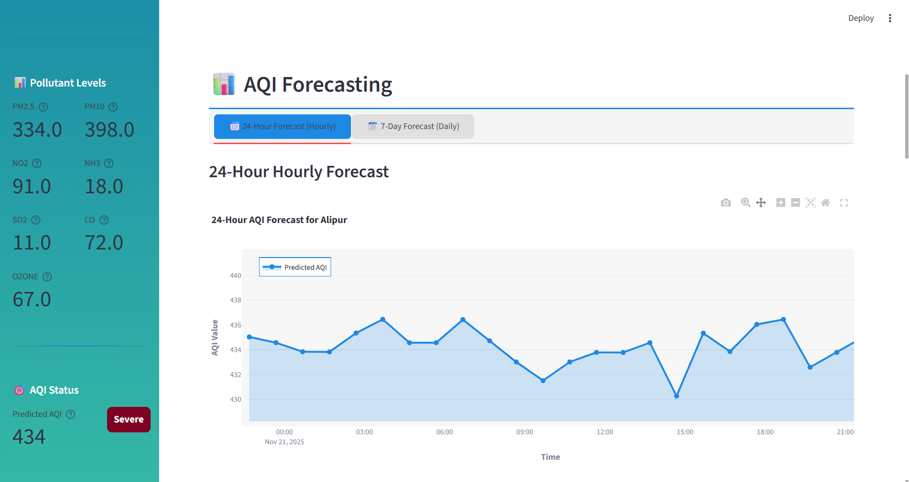
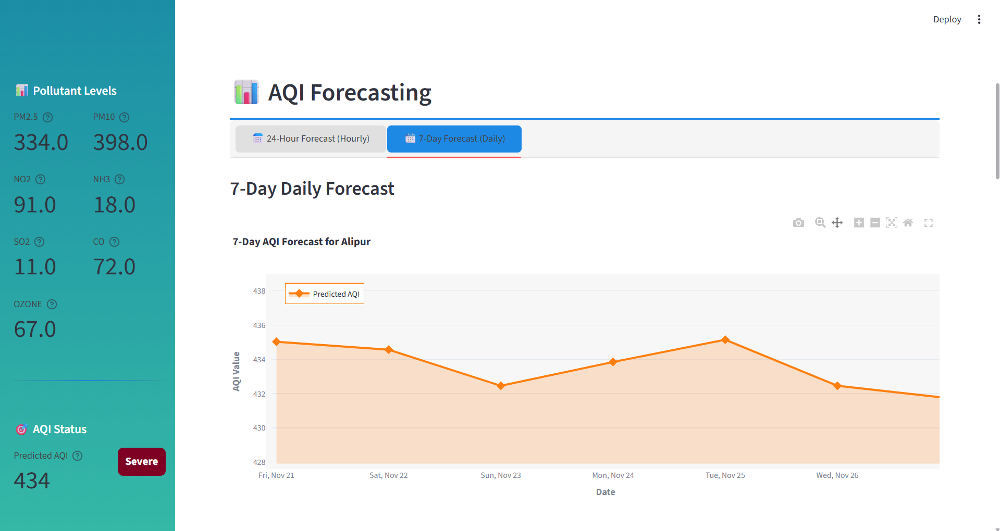
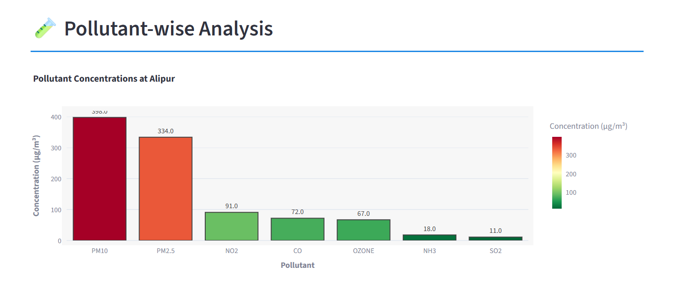
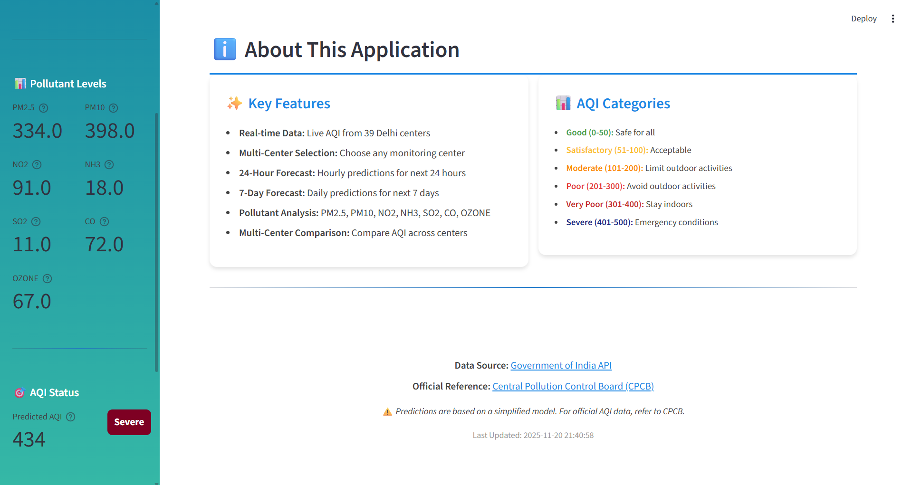

# Delhi Air Quality Index (AQI) Predictor

This is a **Streamlit web application** designed for real-time monitoring, prediction, and forecasting of the Air Quality Index (AQI) for various centers in Delhi, India.

## 🚀 Quick Start

1.  **Install Dependencies:**
    ```bash
    pip install -r requirements.txt
    ```
2.  **Run the Application:**
    ```bash
    streamlit run app.py
    ```
    The application will open in your browser at `http://localhost:8501`.

## ✨ Application Features (Screenshots)

Below are the main features of the application. Please replace the placeholder text with your actual screenshots.

### 1. Home Dashboard

The main landing page, providing an overview of the current AQI status and key metrics.


### 2. AQI Prediction Panel

The section where users can input pollutant values or select a center to get an instant AQI prediction from the machine learning model.


### 3. 24-Hour Forecast

A visualization showing the predicted hourly AQI trend for the next 24 hours.



### 4. 7-Day Forecast

A visualization showing the predicted daily AQI trend for the next 7 days.



### 5. Pollutant Analysis

Detailed charts and tables showing the current concentration levels of individual pollutants (PM2.5, PM10, NO2, etc.).



### 6. Multi-Center Comparison

A view that compares the AQI and pollutant levels across different monitoring centers in Delhi.


### 7. About This Application

Information about the project, the data sources used (e.g., data.gov.in API), and the machine learning model.



---
